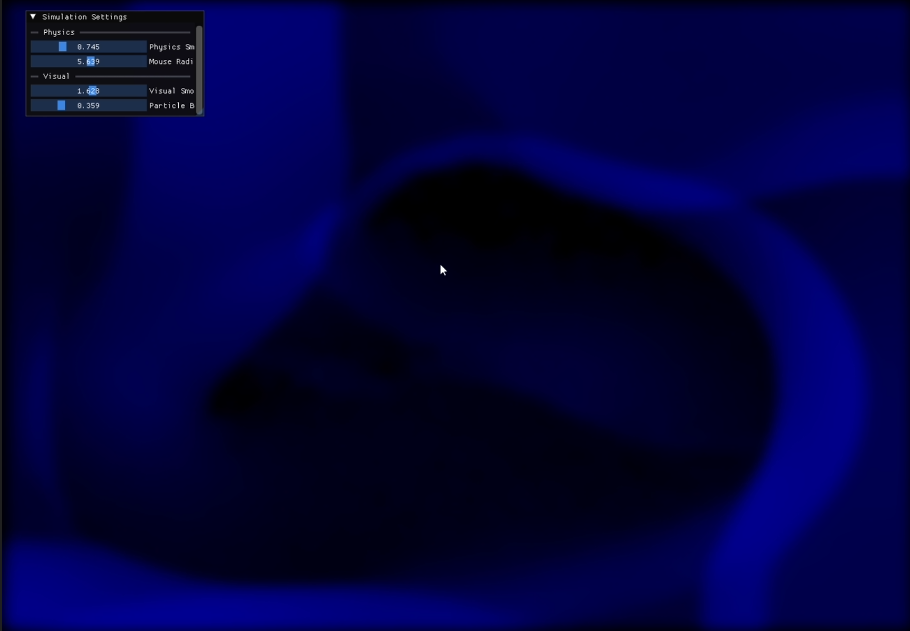
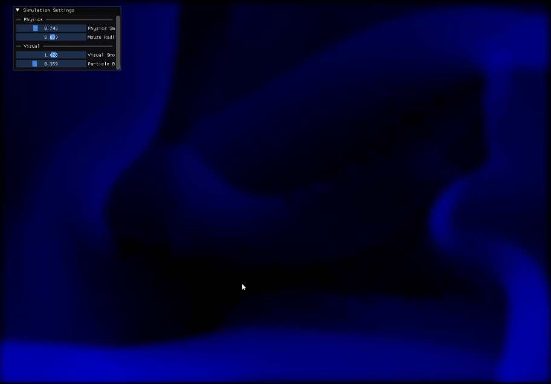

# Real-time GPU Fluid Simulation in OpenGL


## Highlights

* ~32,000 particles simulated fully on the GPU
* Mouse based fluid interaction
* Real-time tunable parameters using Dear ImGui
* Spatial grid acceleration with bitonic sort

<p>
  
  
</p>

## Overview

The fluid simulation is particle based and runs fully on the GPU using OpenGL compute shaders.\
Interactions are optimized by using a grid to categorise particles and sorting them GPU side using bitonic sort, to reduce time complexity from $O(n^2)$ to $O(n\log^2 n)$ sort, and $O(n)$ physics.\
Particle interactions use a repulsion based model and are **not** physically accurate.

## Running The Project

> Examples require g++ with OpenGL 4.6 support

### VSCode

Debug and run tasks are included in project. In VSCode, open the Run & Debug panel (Ctrl+Shift+D) and select *Run OpenGL Project* from the dropdown, then press F5.

### Manual Build

```bash
g++ -O2 main.cpp src/glad.c src/imgui/*.cpp -Iinclude -Iinclude/imgui -Llib -lglfw3 -lopengl32 -lgdi32 -o main.exe
```

## Parameters

### Physics

**Physics Smoothing Radius**: The distance particles act over in grid units (grid is 64 x 48 cells).  
**Mouse Radius**: The radius of the cursor's circle of interaction in grid units.  

### Visual

**Visual Smoothing Radius**: The distance pixel values consider for calculating their value in grid units, effectively works as a blur size to visualize the fluid continuously.  
**Particle Brightness**: A scale value for the brightness of pixels.  
